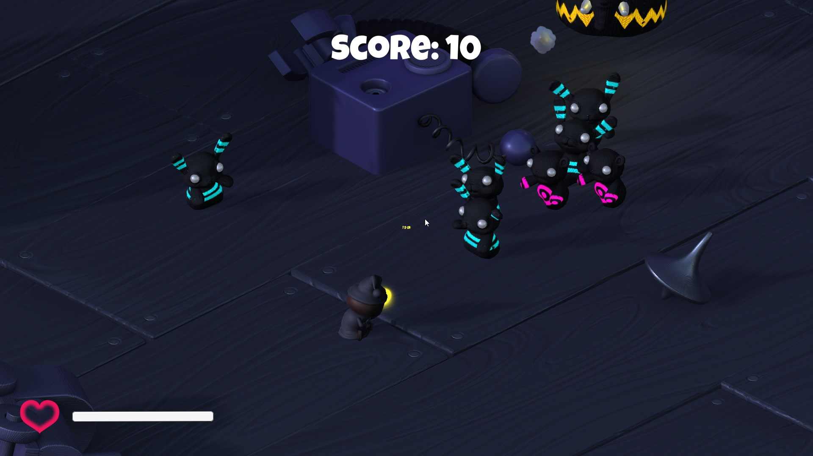

# Sleep Shooter

This is a survival style orthogonal shooter. You play as a sleepy tiny dude who shoots zombie rabbits, bears, and elephants.

This game is made as a study in game development, presented by Agate Academy.

## How To Install
To install this game, please download the compressed file from the Release section of this github page. Once downloaded, unpack the zip (or tar) file.
Once you're done unpacking, you're all set! There is no complex installation needed really.
## How To Run
To run the game, navigate through the folder that you unpacked the game into. Inside the 'Build' folder, run the 'Survival Shooter.exe' file, setup your prefered resolution size, and the game runs right away it. Windowed mode is recommended to close the game easily since there's no exit button in the game. Have fun!

## Features & Keybinds

- This is a single player game.
- The rules are simple, rack up as many points as you can by killing all the Zombunnies, Zombears, and Hellephants before they kill you.
- Controls:
  - Movement: WSAD or Arrow keys
  - Mouse: Aim
  - Left Mouse Button: Shoot
- You can obtain 3 types of power ups which automatically trigger when picked up:
  - Red -> Insta Health: Restore all your health
  - Green -> Speed Boost: Gain a momentary movement speed boost
  - Yellow -> Damage Bonus: Gain a momentary damage bonus

## Contributor

- Gregorius Jovan Kresnadi | 13518135
